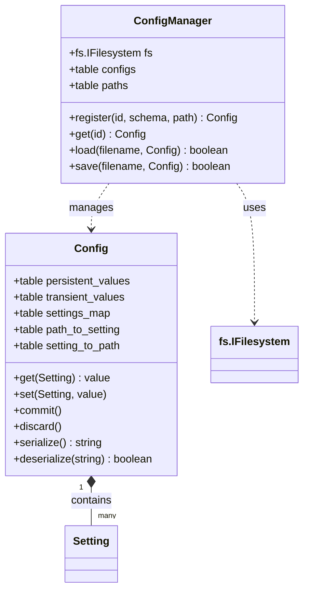

## Goal

Define the architecture and specification for the new configuration system in Rizu. This system utilizes a structured, object-model approach supporting localization, state-observability, custom side effects (lifecycle hooks), and immediate-by-default settings application with selective deferral. It integrates with the new retained UI framework (`yi` module) and replaces legacy settings entirely.

## User Experience

- **Immediate Application by Default**: Most settings (e.g., audio volumes, scroll speed) apply instantly as the user interacts with the UI (e.g., dragging a slider) for immediate feedback.
- **Selective Deferral**: Potentially disruptive changes (e.g., screen resolution, graphic presets) are deferred and only applied when the user clicks "Apply" or confirms upon exiting the menu.
- **Consistent Localization**: Setting names and tooltips are localized using a structured dot-notation format:
  - `group.section.setting` (for the setting name)
  - `group.section.setting.description` (for the tooltip/description text)

## Architecture Decisions

### 1. Data Model & Class Structure

The configuration data model is represented by three main classes: `Config`, `Setting`, and `ConfigManager`.

#### The `Setting` Class
- **Modular Definition**: Each setting is defined in its own individual Lua file.
- **Fields**: The `Setting` class defines:
  - `kind: string` — Represents the UI widget type to render in the `yi` UI: `"checkbox"`, `"textbox"`, `"choice"`, `"slider"`, etc.
  - `is_deferred: boolean` — Flag representing if changes to this setting are staged in a transient buffer until committed.
  - `is_experemental: boolean` — Flag indicating if the setting is experimental.
  - `is_restart_required: boolean` — Flag indicating if a game restart is required to apply the change.
- **Fluent Property Chaining**: Fluent methods allow chaining properties on a setting instance:
  - `setting:setDeferred(boolean)`: Sets whether the setting is deferred and returns `self`.
  - `setting:setExperemental(boolean)`: Sets whether the setting is experimental and returns `self`.
  - `setting:setRestartRequired(boolean)`: Sets whether the setting requires a restart and returns `self`.
- **No Behavior/State on Setting**: Apart from metadata configuration, the `Setting` class is a pure data description structure. It does not carry values, accessor methods, or lifecycle side-effect hooks. Centralizing all logic inside `Config` keeps settings lightweight and easy to serialize.

#### Subclasses
- **`Checkbox`**: Renders a togglable checkbox.
  - `kind` = `"checkbox"`
- **`Choice`**: Renders a combo-box/selection choice list.
  - `kind` = `"choice"`
  - `options` — Array of values/choices.
  - `format` — Optional function to format choice items for human-readable display.
- **`Slider`**: Renders a range selection slider.
  - `kind` = `"slider"`
  - `min_value` — Minimum boundary value.
  - `max_value` — Maximum boundary value.
  - `step` — Increment step value.
- **`Textbox`**: Renders a text input box.
  - `kind` = `"textbox"`
  - `is_secret` — Boolean indicating if text should be obscured/masked (e.g. passwords).
  - `max_characters` — Optional maximum text length constraint.

#### The `Config` Class
- **Constructor**: `Config:new(schema)` takes a schema table.
- **Tree Discovery**: The class is schema-layout agnostic and recursively walks the input `schema` tree to register setting paths (e.g., `"audio.volume.master"`) to setting instances.
- **Flat Hashmap Lookups**: To optimize access, `Config` maintains a flat `settings_map` of registered settings and path lookup tables (`path_to_setting` and `setting_to_path`).
- **Serialization and Deserialization**:
  - `Config:serialize()`: Returns a JSON-serialized string of the current `persistent_values` mapped by setting path.
  - `Config:deserialize(json)`: Deserializes setting path-value pairs from a JSON string into `persistent_values`.

#### The `ConfigManager` Class
- **Centralized Registry & IO**: Acts as a central registry for `Config` instances and handles all file reading and writing operations to load or save configuration state without polluting the core `Config` model.
- **Fields**:
  - `fs: fs.IFilesystem` — Filesystem interface instance used for file operations (defaults to `LoveFilesystem` inside LÖVE runtime, or `LinuxFilesystem` under CLI/testing).
  - `configs: table` — A map of registered `id` strings to their `Config` instances.
  - `paths: table` — A map of registered `id` strings to their file paths.
- **Methods**:
  - `ConfigManager:new(target_fs)`: Instantiates the manager with a filesystem implementation.
  - `ConfigManager:register(id, schema, path)`: Instantiates a `Config` from the `schema`, registers it under the given `id` with the associated `path`, and returns it.
  - `ConfigManager:get(id)`: Retrieves a registered `Config`.
  - `ConfigManager:load(filename, config)`: Reads JSON configuration from file and deserializes it into the config.
  - `ConfigManager:save(filename, config)`: Serializes configuration and writes it to file.
  - `ConfigManager:loadById(id)` / `saveById(id)`: Loads or saves a registered config using its registered path.

---

### 2. State Management & Centralized Access

All reads and writes of configuration values are handled centrally by `Config` using the setting instances as keys.

- **Centralized Get**: `Config:get(setting)` reads the value. It looks up the transient (temporary) state first, falling back to the persistent state.
- **Centralized Set**: `Config:set(setting, value)` validates the incoming value and updates the appropriate state.
- **Side Effects and Event Propagation**: `Config` is solely responsible for execution of side effects and event propagation. Whenever a setting is updated and applied, it triggers the registered side-effects and emits change events to any observers.

---

### 3. Application Strategy (Immediate vs. Deferred)

To balance real-time user feedback with application stability, settings apply immediately by default, with selective buffering for disruptive settings.

- **Immediate Settings (Default)**:
  - Any setting with `is_deferred == false` applies immediately.
  - `Config:set(setting, value)` updates the persistent state.
- **Deferred Settings (`is_deferred == true`)**:
  - Settings where `is_deferred` is true are staged in a transient state buffer.
  - `Config:get(setting)` checks the transient buffer first, falling back to the persistent state if no staged change exists.
  - `Config:commit()` applies all staged changes in the transient buffer to the persistent state, triggers event emissions for the changes, and clears the transient buffer.
  - `Config:discard()` clears the transient buffer, reverting any uncommitted changes in the UI.

---

### 4. Integration with Retained UI (`yi` module)

The configuration system works natively with the retained UI architecture in the `yi` module:
- **No Frame-by-Frame Polls**: The UI components do not poll or set values every frame. They bind to settings through event observers.
- **Data Binding**: Input widgets in the `yi` module update their visual states by observing configuration changes, and fire `Config:set()` only when the user commits an input action (e.g., finishing a text entry, selecting a dropdown item, or dragging a slider).
- **Deprecation**: Legacy configuration models and the legacy `SettingsView` are completely replaced by this architecture.
